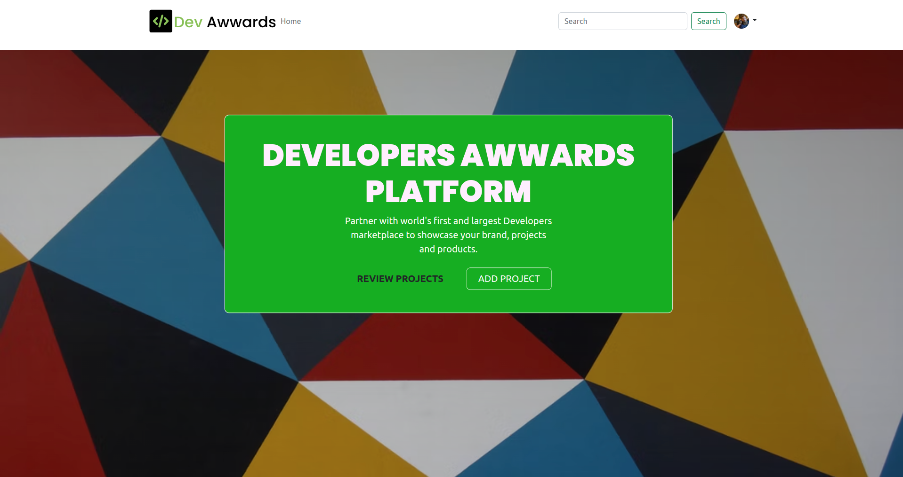

# Dev-Awwards
Dev-Awwards is an online platform that gives web developers and designers a space to post their projects in order to receive feedback from other developers as well as industry experts.

### A sneek peek of the Application

## Application User Story

As a user, I would like to:

1. View posted projects and their details
2. Post a project to be rated/reviewed
3. Rate/ review other users' projects
4. Search for projects 
5. View projects overall score
6. View my profile page

## Tech Stack Used

1. Python / Django / Django Rest Framework - Backend
2. Bootstrap5/ Html5/JavaScript/CSS3 - Frontend
3. PostgreSQL - Backend(Database)

## API Endpoints Used
1. Project Endpoint: https://devawwwards.herokuapp.com/project/
2. Profile Endpoint: https://devawwwards.herokuapp.com/profile/

## Setup & Installation 

### Prerequisites
- python3.8
- Django 4
- PostgreSQL
- Virtual environment
- requirements.txt

### Cloning and Using the Application
In your terminal:

1. $ git clone git@github.com:bignimz/dev-awwards.git
2. pip install -r requirements.txt
3. create a new virtual environment (virtual)
4. run python manage.py runserver    

## Known Bugs

Currently there is no known bug, but pull requests are allowed incase you spot any other bug

## Contribution

Pull requests are welcome. For major changes, please open an issue first to discuss what you would like to change.

Please make sure to update tests as appropriate.

## Project Author

Name: Nimrod Musungu  
Email: nimrod.chitayi@gmail.com 
Website: nimrodmusungu.com

